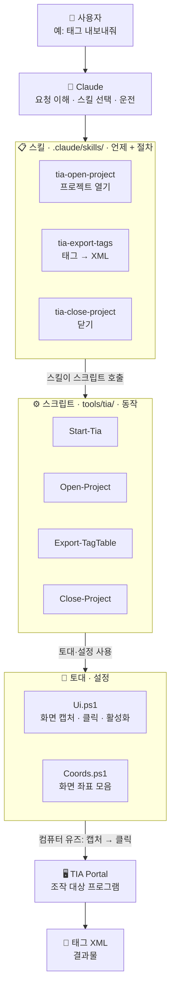

# 프로젝트 구조 (ARCHITECTURE)

**한 문장 요약:** Claude가 화면을 보고(캡처) 마우스·키보드로 TIA Portal을 직접 조작해, 태그 같은 데이터를 자동으로 내보내는 툴킷입니다.

---

## 구조와 흐름 (한눈에)

> 아래 다이어그램은 GitHub에서 자동으로 그림으로 표시됩니다 (Mermaid).

---

## 계층별 역할

| 계층 | 위치 | 역할 | 비유 |
|---|---|---|---|
| 사용자 | — | 자연어로 요청 | 손님 주문 |
| **Claude** | — | 요청 이해 · 스킬 선택 · 화면 보며 운전 | 주방장 |
| **스킬** | `.claude/skills/` | "언제 + 어떤 절차" (작업 단위). 자연어로 자동 실행 | 레시피 카드 |
| **스크립트** | `tools/tia/` | 실제 마우스·키보드 동작 (작은 단위) | 주방 도구 |
| **토대** `Ui.ps1` | `tools/desktop/` | 화면 캡처(눈) + 클릭·키보드(손) + 창 활성화 | 눈·손 |
| **설정** `Coords.ps1` | `tools/tia/` | 화면 좌표 한 곳 모음 (**새 컴퓨터는 이 파일만 수정**) | 좌표 지도 |
| TIA Portal | (외부 앱) | 조작 대상 | — |
| **문서·기록** | `CLAUDE.md` · `context.md` · `README.md` · 메모리 | 규칙 · 살아있는 기록 · 안내 | 설명서 |
| (제외) `tia-projects/` | 로컬만 | 회사 실제 프로젝트 사본 — **git 제외(기밀)** | — |

---

## 예시 흐름: "태그 내보내줘"

1. 사용자가 **"태그 내보내줘"** 라고 말함
2. Claude가 **`tia-export-tags` 스킬**을 자동 선택
3. 스킬 절차대로: (필요하면) `Start-Tia` → `Open-Project` → 트리에서 태그 테이블 열기 → **`Export-TagTable.ps1`**
4. 스크립트는 **`Ui.ps1`** 로 화면을 캡처·클릭하고, **`Coords.ps1`** 의 좌표를 사용
5. TIA Portal이 **태그 XML**을 생성 → 파일 크기로 검증

> 핵심 구분: **스킬 = "작업 단위(언제+절차)"**, **스크립트 = "작은 동작"**, **Ui.ps1 = 눈+손**, **Coords.ps1 = 좌표(이식성의 열쇠)**.

---

## 여기서 시작 (처음 보는 사람용)

1. **[README.md](README.md)** — 개요 · 사용법 · 좌표 기록 · 새 컴퓨터 설정 체크리스트
2. **이 문서(ARCHITECTURE.md)** — 전체 구조와 관계
3. **`tools/tia/` 스크립트 헤더 주석** — 각 동작의 세부
4. **[context.md](context.md)** — 프로젝트 맥락 · 진행 로그 · 검증된 교훈
5. **새 컴퓨터에서 쓸 때**: 화면이 1920×1080·100%가 아니면 `tools/tia/Coords.ps1` 좌표만 그 화면 기준으로 수정 (스크립트가 불일치 시 경고함)

---
🤖 Generated with [Claude Code](https://claude.com/claude-code)
